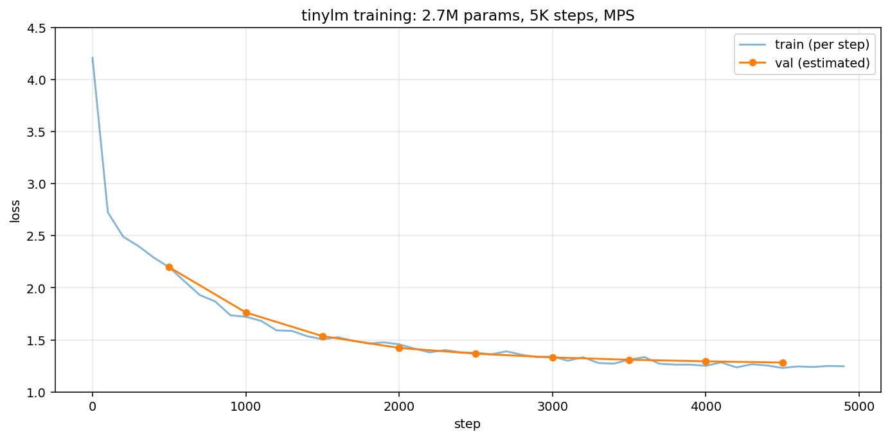

# tinylm

A small GPT, trained on Shakespeare. ~2.7M params, written from scratch in PyTorch. Every component (multi head attention, KV cache, causal masking, positional embeddings, weight tying, GPT-2 init) is hand rolled. No `nn.MultiheadAttention` or `nn.TransformerEncoder`, no flash attention.

The point wasn't to build something useful. It was to make sure I could read the GPT-2 paper and have an opinion about every line.

## Why

This is the follow up to [nanograd](https://github.com/mohinpatell/nanograd), where I built an autograd engine from scratch. Same idea here: I'd read enough about transformers that I could draw the diagram, but I couldn't have written it on a whiteboard without looking. So I wrote it.

I wanted the model small enough to train on my laptop in under an hour, big enough that the residual stream and layer count actually matter. 6 layers, 192d, 6 heads landed at 2.7M params. Trains in ~30 min on Apple Silicon (MPS).

The whole project took about three weeks of evenings, mid January through early February 2026.

## What's in here

```
model.py       GPT model. CausalSelfAttention, FeedForward, TransformerBlock, GPT.
train.py       training loop. AdamW, cosine LR with linear warmup, grad clip.
generate.py    sampling. temperature + optional top-k or top-p, KV cached decoding.
dataset.py     next-token TextDataset over Shakespeare.
tokenizer.py   character level tokenizer (65 chars). also downloads the data.
config.py      GPTConfig + TrainConfig dataclasses.
test_model.py  attention sanity checks, including a numeric match against torch.nn.MultiheadAttention.
demo.ipynb    loss curve and generation samples.
```

## Architecture choices

```
token + positional embedding (learned)
     |
     v
[ TransformerBlock ] x 6
   ln -> multi head causal self attention -> residual
   ln -> feed forward (4x, GELU)            -> residual
     |
     v
final ln -> linear head (weight tied with token embedding)
```

A few specific decisions worth calling out:

- **Pre norm.** LayerNorm before attention/FFN, not after. Post norm trains worse at depth — gradient signal has to fight the residual every layer.
- **Learned positional embeddings**, not RoPE or sinusoidal. The original GPT-2 choice. RoPE would have been better for extending context but I capped at 256 tokens and didn't need it.
- **Weight tying** between `tok_emb` and the output head. Shaves ~12K params at this size, also acts as a soft regularizer because the same vector represents "what token N is" and "how to score token N as the next one."
- **GPT-2 init.** `N(0, 0.02)` everywhere, then residual projections (`attn.out_proj`, `ffn.fc2`) are rescaled to `0.02 / sqrt(2 * n_layer)`. Without this rescale, the residual stream's variance grows roughly linearly with depth and the loss is unstable for the first few hundred steps. With it, the loss starts smooth.
- **GELU** in the FFN, not ReLU. Standard for GPT and basically free.
- **Bias=True on all the Linears** except the output head (which is tied to the embedding and so has no bias by definition). I didn't try `bias=False` everywhere — it's a known small win but I was running out of evening.
- **AdamW** with `betas=(0.9, 0.95)`, weight decay 0.1 on 2D+ params only (skip biases and LayerNorms). Cosine LR with linear warmup over 200 steps, decay floor at 10% of peak. Grad clip at 1.0.
- **No dropout on the residual stream**, only on attention weights and the FFN output. 0.1.

## Training run

5,000 steps, batch size 64, block size 256. About 30 minutes on an M-series MPS device. ~80M tokens seen total (5000 steps × 64 batch × 256 ctx).



| metric | value |
|---|---|
| params | 2,731,200 |
| final train loss | 1.2465 |
| final val loss   | 1.2815 |
| train/val gap    | 0.0350 |
| val perplexity (per character) | 3.60 |

The train/val gap is small enough that the model isn't memorizing. There's still room to train longer or scale up — the curve is still drifting down — but for 1MB of text and a character level vocab, this is roughly where it plateaus.

A sample at temperature 0.8, top-k 40:

```
ROMEO:
I am made a word; for any are mock,
And that thou wilt be the kingdom of the cold.

JULIET:
What ever are did I  do; for I shall report
The scope that I was done a foe?

ROMEO:
The time world is rest that thy duke three.

FRIAR LAURENCE:
I have not; so shortly of thee,
```

It picks up character names, dialogue formatting, verse-shaped line lengths, and Shakespearean vocabulary (thou, hath, doth, wherefore). It does not have meaning. With a character tokenizer and 1MB of training data, that's about as far as you can push it.

## Things that broke

A few that were worth remembering.

**The init code referenced `config.n_layer` instead of `self.config.n_layer`.** Wrote the GPT class on Jan 17 with a `_init_weights` that did `0.02 / math.sqrt(2 * config.n_layer)` — `config` is not in scope inside that method. Anyone instantiating `GPT(config)` would have hit `NameError` on the first call. I committed it without ever instantiating the model. Found it on Jan 21 when I sat down to write the training loop and the first `model = GPT(gpt_config)` blew up. Lesson: a script you haven't run is a script that doesn't work, no matter how confident the diff looks.

**The causal mask must be skipped when using KV cache.** During training, q and k both have shape `(B, H, T, d)` and the lower triangular mask makes sense. During cached decoding, q is `(B, H, 1, d)` (just the new token) but k is `(B, H, T_cached + 1, d)` (everything). The mask `self.mask[:, :, :T, :T]` crops to `(1, 1, 1, 1)`, which would force the new token to attend only to itself and ignore all the cached context. The fix is to skip the mask when `kv_cache is not None` — at that point the new token is always the last token in time and is *allowed* to attend to everything before it. See `model.py:48`.

**Position offset with KV cache.** Same commit. With cached decoding I was passing in just the new token, so `idx.shape[1] == 1` always. The original code did `pos = torch.arange(T)`, which gave the new token position 0 every time. Generation collapsed to garbage after a few tokens because every new token thought it was at the start of the sequence. Fix is to read the cache length out of `kv_caches[0][0].shape[2]` and offset positions from there. See `model.py:128`.

**The KV cache scale up broke every test, silently.** Switching the model to return `(logits, loss, new_kv_caches)` meant every `_, loss = model(x, y)` in the test file became `_, loss = (logits, loss, caches)` — Python happily unpacked the wrong things and the tests still ran. The breakage was caught by hand reading, not by a failing assert. I now lean on tests where the *shape* of the unpacking is itself part of the contract, and on type checkers.

## Validation against PyTorch

`test_model.py` contains a numeric check against `torch.nn.MultiheadAttention`. The trick is that PyTorch's MHA uses a fused `in_proj_weight` of shape `(3*C, C)` — same layout as my `qkv_proj.weight` — so I can copy weights across without any reshape. With weights and biases copied, dropout off, both in `eval`, my output is bit identical to PyTorch's (`max diff: 0.00e+00` on CPU with torch 2.2). Passing this is what made me trust the layout.

## What's not here

Things I deliberately skipped:

- **Flash attention.** Wanted to read the kernel paper before pulling in `F.scaled_dot_product_attention`. Didn't get to it. The naive `softmax(QK/sqrt(d))V` is fine at this scale.
- **`torch.compile`.** Did not benchmark. Suspect it would help on CUDA, less on MPS.
- **Mixed precision.** Apple's MPS bf16 path was sketchy when I started. CPU/GPU autocast wasn't worth the debugging.
- **Distributed training.** Single device only. AdamW state dict + `state_dict` save are the only persistence.
- **Subword tokenizer.** This uses a 65 character vocab. After this I built [bytetoken](https://github.com/mohinpatell/bytetoken), a byte level BPE that's the natural next step.
- **Streaming dataset.** Whole Shakespeare corpus lives in RAM. Fine for 1MB, would not be fine for 10GB.
- **A real eval.** I report val loss and per-character perplexity, not anything you could compare across models. For something this small that's enough.

## How to run

```bash
pip install -r requirements.txt

# train (~30 min on MPS, ~90 min CPU)
python train.py

# generate
python generate.py --prompt "ROMEO:" --tokens 500 --temperature 0.8 --top-k 40
```

Training writes a checkpoint to `checkpoints/model.pt` (model state, config, and the char vocab). `generate.py` rebuilds the tokenizer from that.

## References

- *Attention Is All You Need* — Vaswani et al., 2017. The base transformer.
- *Language Models Are Unsupervised Multitask Learners* — Radford et al., 2019. The GPT-2 paper, source of the init scheme and the pre norm decision.
- *On Layer Normalization in the Transformer Architecture* — Xiong et al., 2020. Why pre norm trains better at depth.
- Karpathy's [nanoGPT](https://github.com/karpathy/nanoGPT) and [makemore](https://github.com/karpathy/makemore). I read both before writing this; the structure of `train.py` owes them obvious debts.
